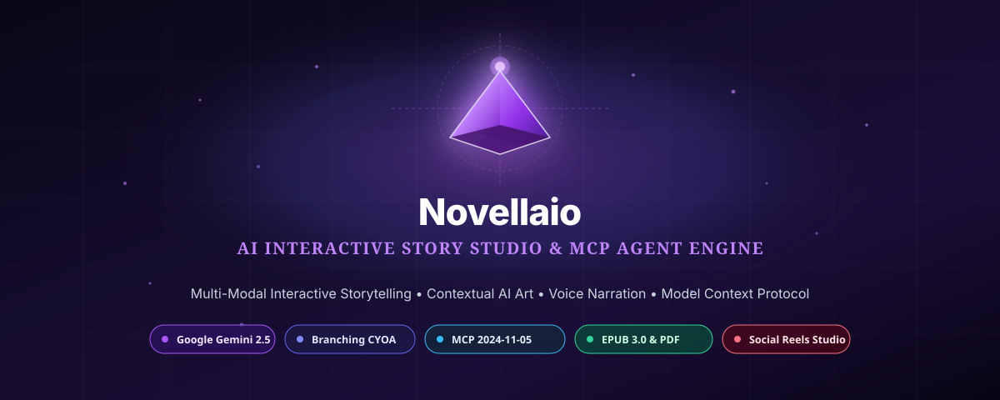
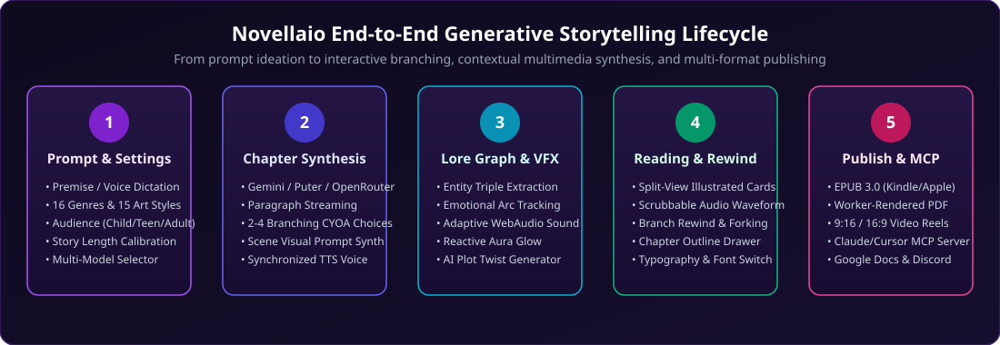
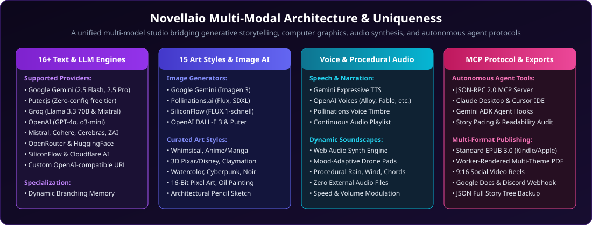

<div align="center">

# 🌟 Novellaio
### Interactive Multi-Modal AI Storytelling Studio & Autonomous MCP Agent Engine

[](https://github.com/your-username/ai-storyteller)

<br/>

[](https://react.dev/)
[](https://www.typescriptlang.org/)
[](https://vitejs.dev/)
[](https://tailwindcss.com/)
[](https://ai.google.dev/)
[](https://modelcontextprotocol.io/)
[](LICENSE)

<br/>

**Weave, illustrate, narrate, and publish interactive branching storybooks powered by cutting-edge Multi-Modal AI and autonomous agent toolkits.**

[Quick Start](#-getting-started) • [How It Works](#-how-it-works-step-by-step) • [Key Features](#-comprehensive-feature-suites) • [MCP Agent Studio](#-model-context-protocol-mcp-agent-studio) • [Architecture](#-system-architecture) • [Publishing & Video](#-publishing--multi-format-export-engine)

</div>

---

## 📌 Project Identity

- **Project Name:** `Novellaio: Multi-Modal AI Storyteller & Studio`
- **Elevator Pitch:** `Create interactive illustrated storybooks with branching plots, contextual AI art, voice narration, ambient soundscapes, dynamic lore knowledge graphs, MCP agent toolkits, EPUB & video exports.`
- **Target Audience:** Readers, educators, writers, game masters, children, teens, and developers integrating autonomous AI agents.

---

## 📖 Executive Summary

**Novellaio** is an interactive, multi-modal generative AI storytelling platform and creative production studio. Built on modern web standards (**React 19**, **TypeScript 5.8**, **Vite 6**, and **Tailwind CSS v4**), Novellaio bridges large language models, computer graphics generation, speech synthesis, procedural audio synthesis, and autonomous agent orchestration via the official **Model Context Protocol (MCP 2024-11-05 specification)**.

Whether creating whimsical bedtime fables for children, interactive mystery thrillers for young adults, or epic multi-chapter fantasy novels, Novellaio transforms simple ideas into living, illustrated, voiced, and exportable multimedia books.

---

## 🔄 End-to-End Generative Lifecycle

[](./assets/workflow-diagram.svg)

---

## 💡 What Makes Novellaio Unique?

[](./assets/feature-matrix.svg)

1. **Paragraph-by-Paragraph Interactive Branching (CYOA)**: Rather than generating a static wall of text, stories unfold sequentially with rich illustrations and 2–4 narrative decision choices after each segment.
2. **Contextual Multi-Style Visual Synthesis**: Scene-aware prompt synthesis crafts matched artwork in **15 curated art styles** (from Anime and Whimsical Watercolor to 3D Pixar, Claymation, and Cyberpunk).
3. **Dynamic Lore & Semantic Knowledge Graph**: Extracts entity triples (characters, locations, magical items, factions, events) and tracks character emotional arcs to prevent continuity drift in long narratives.
4. **Procedural Web Audio Mood Soundscapes**: Real-time synthesized ambient pads, nature soundscapes, and harmonic chords tailored to story sentiment using Web Audio API—with **zero external audio assets required**.
5. **Native Model Context Protocol (MCP) Server**: Exposes complete storytelling, art synthesis, narrative flow auditing, and publishing capabilities as standardized JSON-RPC 2.0 tools for **Claude Desktop**, **Cursor IDE**, and **Gemini ADK agents**.
6. **Worker-Accelerated Publishing Suite**: Pure client-side compilation of valid **EPUB 3.0 eBooks**, **multi-themed PDF books** via OffscreenCanvas web workers, and **social video reels (9:16 / 16:9 / 1:1)** with karaoke-style synchronized subtitles.

---

## 🚀 How It Works (Step-by-Step)

```
  ┌─────────────────┐      ┌─────────────────────────┐      ┌─────────────────────────┐
  │ 1. Story Prompt │ ───► │ 2. Multi-Modal Gen      │ ───► │ 3. Lore & VFX Engine    │
  │    & Settings   │      │    • Text Paragraphs    │      │    • Entity Graph       │
  │    • Genre      │      │    • Scene Illustration │      │    • Sentiment Arc      │
  │    • Art Style  │      │    • Voice Narration    │      │    • Ambient Synth      │
  │    • Audience   │      │    • Branching Choices  │      │    • Plot Twist Engine  │
  └─────────────────┘      └─────────────────────────┘      └─────────────────────────┘
                                                                         │
  ┌─────────────────┐      ┌─────────────────────────┐                  │
  │ 5. Multi-Format │ ◄─── │ 4. Interactive Studio   │ ◄────────────────┘
  │    Publishing   │      │    • Branch Rewind      │
  │    • EPUB 3.0   │      │    • Chapter Outline    │
  │    • Themed PDF │      │    • Audio Scrubber     │
  │    • 9:16 Video │      │    • Model Switching    │
  │    • MCP Server │      └─────────────────────────┘
  └─────────────────┘
```

### Step 1: Prompt & World Calibration
- Enter a story seed or click the **Microphone** icon for hands-free voice dictation.
- Select from **16 story genres** (*Fantasy, Sci-Fi, Mystery, Adventure, Superhero, Romance, Horror, Historical, Bedtime, etc.*).
- Calibrate the **Target Audience** (*Children, Teen, Adult*) to automatically tailor vocabulary, moral depth, and narrative pacing.
- Pick a target **Story Length** (*Very Short: 3–5 segments, Short: 6–8, Medium: 10–14, Long: 18–24, Very Long: 30+*).
- Choose from **15 distinct visual art styles** (*Whimsical, Anime/Manga, 3D CGI, Classical Oil, Pixel Art, Watercolor, etc.*).

### Step 2: Multi-Modal Chapter & Scene Synthesis
- The selected AI engine (Google Gemini 2.5 Flash, Puter.js, Groq, OpenAI, etc.) generates the narrative paragraph with rich sensory details.
- Simultaneously, scene-aware prompts are dispatched to synthesize matching scene artwork (Google Imagen 3, Pollinations Flux/SDXL, SiliconFlow, DALL-E 3).
- Expressive Text-to-Speech (TTS) synthesizes synchronized voice narration for the generated text.
- The engine generates 2–4 logical branching decision choices or allows typing custom actions.

### Step 3: Semantic Knowledge Graph & Ambient VFX
- The **Graph Extractor** parses entities (*characters, places, items, factions, events*) and registers relations into the **Global Story Graph**.
- Emotional sentiment is computed for the chapter segment, updating character arc timelines.
- The **Web Audio Procedural Synthesizer** dynamically morphs background ambient drone frequencies, nature textures (rain, wind), and chord progressions to match the narrative tension.
- The **VFX Aura Canvas** shifts ambient background glows and particle streams to mirror the mood.

### Step 4: Interactive Reading & Time-Travel Rewind
- Read the illustrated segment in high-contrast typography with customizable book fonts (*Cinzel, Merriweather, Lora, Outfit, MedievalSharp, Caveat, Playfair Display*).
- Listen with the floating continuous audio player or seek through individual paragraph scrubbers.
- Use **Rebranch & Rewind** to step back to any previous chapter segment and explore alternative timelines.
- Open the **Plot Twists Panel** for AI-suggested unexpected turns across 6 categories (*Shock Revelation, Supernatural Shift, Betrayal, Dramatic Catalyst, Cryptic Mystery, High Stakes Action*).

### Step 5: Professional Publishing & Agent Orchestration
- **EPUB 3.0**: 1-click generation of fully compliant `.epub` books with cover art and table of contents for Apple Books, Kindle, and Kobo.
- **Worker-Rendered PDF**: Export formatted books in 6 designer themes (*Midnight Slate, Classic Ivory, Emerald Parchment, Royal Slate, Cyberpunk, Sunset Crimson*) using background OffscreenCanvas threads.
- **Social Video Reels Studio**: Record 9:16 vertical shorts or 16:9 widescreen videos with word-by-word karaoke-style highlighted subtitles and Ken Burns motion.
- **MCP Server**: Connect autonomous AI agents in Claude Desktop, Cursor, or Gemini ADK to co-author and manage stories via JSON-RPC 2.0.

---

## ✨ Comprehensive Feature Suites

### 1. 🎭 Interactive Story Engine & Branching CYOA
- **Branching Decision Engine**: 2–4 dynamically calculated narrative choices after each paragraph.
- **Custom Player Prompts**: Ability to override preset choices and type freeform character actions.
- **AI Plot Twist Generator**: Context-aware sudden twists with category badges and automatic lore memory injection.
- **Non-Destructive Rebranching**: Rewind to any prior story branch without losing parent state.
- **Chapter Outline Drawer**: Visual table of contents tracking chapter titles, segment counts, reading times, and quick navigation.

### 2. 🎨 Multi-Provider Visual Art Studio
- **15 Curated Art Styles**:
  | Style | Visual Archetype | Best For |
  | :--- | :--- | :--- |
  | **Whimsical** | Vibrant storybook watercolors, playful lighting | Children & bedtime fables |
  | **Anime / Manga** | Makoto Shinkai aesthetic, luminous skies | Fantasy, YA, Sci-Fi |
  | **3D Pixar / CGI** | Volumetric lighting, stylized 3D character design | Animated family adventures |
  | **Cinematic Realistic** | Photorealistic 35mm film rendering, depth of field | Mystery, thrillers, drama |
  | **Pixel Art** | 16-bit retro isometric sprite rendering | Sci-fi, comedy, retro quests |
  | **Classical Oil** | Renaissance brushwork, chiaroscuro lighting | Historical fiction & high fantasy |
  | **Claymation** | Tactile stop-motion textures, studio lighting | Whimsical, comedy, novelty |
  | **Cyberpunk** | High-contrast neon hues, rain-slicked chrome | Dystopian sci-fi, urban noir |
- **Shimmer Skeleton Preloaders**: High-polish animated loading states while graphics are rendered.
- **Single-Scene Regenerator**: Re-roll any individual illustration with adjusted style or prompt overrides.

### 3. 🎙️ Expressive Audio Narration & Web Audio Synth
- **Multi-Provider TTS**: Gemini Expressive TTS, OpenAI Voice Engine (Alloy, Echo, Fable, Onyx, Nova, Shimmer), and Pollinations TTS.
- **Continuous Global Audio Player**: Floating bottom controller with playback progression, chapter skips, speed controls (0.75x–2.0x), and volume mixer.
- **Procedural Ambient Music Engine**: Custom Web Audio oscillators generate generative drones, pad chords, and atmospheric textures matched to genre and sentiment without external audio files.

### 4. 🧠 Entity Lore & Knowledge Graph
- **Entity Semantic Extraction**: Identifies characters, locations, artifacts, factions, and key plot events.
- **Relationship Triples**: Maps connections (e.g., `[Elena] --(guards)--> [Sunken Relic]`).
- **Emotional Timeline**: Visualizes sentiment evolution per character across the story.
- **Context Injection**: Automatically injects lore summaries into future LLM generation prompts to eliminate character amnesia.

### 5. 📚 Automated eBook & PDF Publishing
- **Standard EPUB 3.0 Compiler**: Pure client-side generation of valid `.epub` files ready for major eBook readers.
- **OffscreenCanvas Web Worker PDF Export**: Multi-page rendering offloaded to dedicated web workers to eliminate UI freezing during high-res canvas composition.
- **6 Designer PDF Themes**: *Midnight Slate*, *Classic Ivory*, *Emerald Parchment*, *Royal Slate*, *Cyberpunk*, *Sunset Crimson*.
- **Story-Titled Naming**: Automatic filename sanitization ensuring all exports match the story's actual title.

### 6. 🎬 Social Video Reels Studio & Karaoke Subtitles
- **Multi-Aspect Ratio Canvas**: 9:16 (TikTok / Reels / Shorts), 16:9 (YouTube), 1:1 (Instagram).
- **Karaoke Word-by-Word Subtitles**: Synchronized text highlighting matching speech cadence.
- **Ken Burns Cinematic Motion**: Dynamic zoom-and-pan cameras across scene illustrations.
- **Dual-Stem Audio Recorder**: Combines speech voiceovers and procedural ambient background music into a single recorded canvas stream.

### 7. 🌐 Cloud Storage & Community Integrations
- **Google Workspace & Drive**: Export chapters as formatted Google Docs and manage Google Drive cloud backups.
- **GitHub Gists**: Publish open markdown storybooks directly to GitHub.
- **Discord Community Webhooks**: Dispatch story releases, art cards, and branching polls to Discord server channels.
- **Puter.js Cloud Sync**: Instant cloud synchronization of story libraries with zero backend requirement.

---

## 🔌 Model Context Protocol (MCP) Agent Studio

Novellaio implements the official **Model Context Protocol (MCP 2024-11-05 specification)** at `/api/mcp`. It exposes the full storytelling and publishing pipeline as JSON-RPC 2.0 tools for autonomous agents.

```
  ┌────────────────────────────────────────────────────────┐
  │             External AI Agent Ecosystem               │
  │    Claude Desktop  •  Cursor IDE  •  Gemini ADK Agent  │
  └───────────────────────────┬────────────────────────────┘
                              │ JSON-RPC 2.0 (MCP)
                              ▼
  ┌────────────────────────────────────────────────────────┐
  │             Novellaio MCP Server Endpoint              │
  │                     (/api/mcp)                         │
  ├────────────────────────────────────────────────────────┤
  │  • tools/list            • resources/list              │
  │  • tools/call            • prompts/list                │
  └───────────────────────────┬────────────────────────────┘
                              │
  ┌───────────────────────────┴────────────────────────────┐
  │                 Available MCP Tools                    │
  ├────────────────────────────────────────────────────────┤
  │ 1. generate_story_chapter   5. create_video_reel       │
  │ 2. synthesize_scene_art     6. list_saved_stories      │
  │ 3. audit_narrative_flow     7. post_discord_webhook    │
  │ 4. publish_ebook                                       │
  └────────────────────────────────────────────────────────┘
```

### Supported MCP Tools Catalog

| MCP Tool Name | Description | Key Arguments | Output Schema |
| :--- | :--- | :--- | :--- |
| `generate_story_chapter` | Generates a new chapter segment with branching choices & sentiment analysis | `prompt`, `genre`, `targetAudience`, `style`, `previousContext` | `{ chapterTitle, paragraph, choices, sentiment, mood }` |
| `synthesize_scene_art` | Generates contextual visual art prompts & scene metadata | `paragraph`, `genre`, `style`, `characterContext` | `{ imagePrompt, negativePrompt, visualElements, colorPalette }` |
| `audit_narrative_flow` | Analyzes story pacing, readability grades (Flesch-Kincaid), and tension | `storyText`, `targetAudience` | `{ readabilityGrade, pacingScore, tensionCurve, recommendations }` |
| `publish_ebook` | Compiles a valid EPUB 3.0 package with metadata and chapter structure | `storyTitle`, `chapters`, `author`, `genre` | `{ epubReady, chapterCount, wordCount, amazonKdpKeywords }` |
| `create_video_reel` | Configures a social video timeline with subtitle chunks and audio stems | `storyTitle`, `segments`, `aspectRatio`, `musicGenre` | `{ videoConfigReady, totalDuration, timelineEvents }` |
| `list_saved_stories` | Retrieves the list of saved story titles and metadata from storage | *None* | `{ stories: [{ id, title, segmentCount, timestamp }] }` |
| `post_discord_webhook` | Dispatches story updates and community polls to Discord | `webhookUrl`, `storyTitle`, `chapterText`, `choices` | `{ success: boolean, message: string }` |

---

### Connecting MCP to External Clients

#### 1. Claude Desktop
Add to your `claude_desktop_config.json`:
- **macOS**: `~/Library/Application Support/Claude/claude_desktop_config.json`
- **Windows**: `%APPDATA%\Claude\claude_desktop_config.json`

```json
{
  "mcpServers": {
    "novellaio-ai-studio": {
      "command": "node",
      "args": ["dist/server.cjs"],
      "env": {
        "GEMINI_API_KEY": "YOUR_GEMINI_API_KEY"
      }
    }
  }
}
```

#### 2. Cursor IDE
Add to `.cursor/mcp.json`:

```json
{
  "mcp": {
    "servers": {
      "novellaio": {
        "url": "http://localhost:3000/api/mcp",
        "type": "http"
      }
    }
  }
}
```

#### 3. Testing with cURL / HTTP
```bash
curl -X POST http://localhost:3000/api/mcp \
  -H "Content-Type: application/json" \
  -d '{
    "jsonrpc": "2.0",
    "id": 1,
    "method": "tools/call",
    "params": {
      "name": "generate_story_chapter",
      "arguments": {
        "prompt": "A hidden mechanical dragon awakens beneath the crystal caverns",
        "genre": "fantasy",
        "targetAudience": "children",
        "style": "whimsical"
      }
    }
  }'
```

---

## 🏗️ System Architecture & Codebase Map

```
├── App.tsx                     # Primary Application State Orchestrator & Layout
├── index.html                  # HTML5 Entry Point
├── index.tsx                   # React 19 Root Mounting & Provider Setup
├── types.ts                    # Global TypeScript Data Contracts & Interfaces
├── metadata.json               # Platform Application Metadata
├── vite.config.ts              # Vite 6 Bundler Configuration & Optimization
├── tsconfig.json               # Strict TypeScript Compiler Configuration
│
├── assets/                     # Vector Graphics, Diagrams & Studio Brand Assets
│   ├── hero-banner.svg         # Dark Cosmic Brand Showcase Banner
│   ├── workflow-diagram.svg    # End-to-End Generative Lifecycle
│   └── feature-matrix.svg      # Multi-Modal Capability Matrix
│
├── components/                 # Extracted UI Sub-Components
│   ├── StoryDisplay.tsx        # Reading Canvas, Branch Cards & Audio Timelines
│   ├── StoryInput.tsx          # Initial Prompt Input, Suggestions & Voice Dictation
│   ├── ParagraphCard.tsx       # Illustrated Chapter Card with Choice Selectors
│   ├── PlotTwistsPanel.tsx     # AI Sudden Plot Twist Injector
│   ├── ChapterOutlineDrawer.tsx# Story Tree Navigator & Chapter Manager
│   ├── AudioController.tsx     # Floating Continuous Audio Player & Mixer
│   ├── VideoModal.tsx          # 9:16 / 16:9 Social Video Reels Studio
│   ├── IntegrationsModal.tsx   # OAuth, MCP Agent Console, EPUB & Discord Studio
│   ├── SettingsPanel.tsx       # Model Selection, Art Styles, API Key Management
│   ├── StoryLibrary.tsx        # Saved Stories Repository & Cloud Sync
│   ├── SegmentSkeleton.tsx     # Animated Shimmer Preloaders
│   └── icons.tsx               # Curated Lucide Icons & Custom SVG Visuals
│
├── services/                   # Business Logic & External AI Services
│   ├── geminiService.ts        # Multi-Provider Text, Art, Audio & Twist Engine
│   ├── musicService.ts         # Web Audio API Procedural Ambient Soundscapes
│   ├── storyGraphState.ts      # Global Semantic Knowledge Graph & Lore Memory
│   ├── graphExtractor.ts       # Entity & Emotional Arc NLP Parser
│   └── storageService.ts       # LocalStorage & Puter.js Cloud Sync Engine
│
├── utils/                      # Publishing & Export Utilities
│   ├── epubGenerator.ts        # Client-Side Standard EPUB 3.0 Compiler
│   ├── pdfGenerator.ts         # OffscreenCanvas Web-Worker Multi-Theme PDF Engine
│   └── chapterUtils.ts         # Chapter Splitting, Time Estimation & Sanitization
│
└── vfx/                        # Visual Effects & Dynamic Atmosphere
    ├── VfxContext.tsx          # Story Sentiment to Canvas Aura Provider
    └── ParticleCanvas.tsx      # Procedural Cosmic Dust & Sparkle Particles
```

---

## 🛠️ Supported AI Providers & Models

Novellaio features a decoupled, multi-provider engine allowing users to mix and match LLMs, image synthesis engines, and audio providers:

### Text & Storytelling LLMs
- **Google Gemini**: Gemini 2.5 Flash, Gemini 2.5 Pro, Gemini 2.0 Flash
- **Puter.js**: Free tier zero-configuration cloud LLM
- **Groq**: Llama 3.3 70B Versatile, Mixtral 8x7B
- **OpenAI**: GPT-4o, GPT-4o-mini, o3-mini
- **Mistral AI**: Mistral Large, Mistral Small, Codestral
- **Cohere**: Command R+, Command R
- **Cerebras**: Ultra-fast Llama 3.1 8B / 70B
- **SiliconFlow & Cloudflare Workers AI**: DeepSeek, Qwen, Llama series
- **OpenRouter & Hugging Face**: Access to 100+ open-source foundation models
- **Custom Base URL**: Any OpenAI-compatible REST API endpoint

### Image Art Generators
- **Google Gemini**: Imagen 3 / Imagen 3 Fast
- **Pollinations.ai**: FLUX.1, SDXL (zero API key required)
- **SiliconFlow**: FLUX.1-schnell, FLUX.1-dev, SDXL
- **Hugging Face Inference API**: Stable Diffusion 3.5, FLUX
- **OpenAI**: DALL-E 3
- **Cloudflare Workers AI**: @cf/black-forest-labs/flux-1-schnell

### Voice Narration & Audio
- **Google Gemini**: Native expressive Text-to-Speech
- **OpenAI Audio**: `alloy`, `echo`, `fable`, `onyx`, `nova`, `shimmer`
- **Pollinations Audio**: Multi-voice TTS
- **Novellaio Procedural Synth**: Genre-adaptive Web Audio ambient music generator

---

## 💻 Getting Started & Local Setup

### Prerequisites
- **Node.js**: v18.0.0 or higher
- **Package Manager**: `npm`, `pnpm`, or `bun`

### Installation

```bash
# 1. Clone the repository
git clone https://github.com/your-username/ai-storyteller.git
cd ai-storyteller

# 2. Install dependencies
npm install

# 3. Configure environment variables (optional for local API keys)
cp .env.example .env

# 4. Launch the local development server
npm run dev
```

The application will be accessible at `http://localhost:3000`.

### Production Build

```bash
# Compile client bundle and standalone CommonJS backend server
npm run build

# Launch production server
npm run start
```

---

## 🔒 Security & API Key Privacy

- **Client-Side Key Option**: All custom third-party API keys (OpenAI, Groq, OpenRouter, etc.) entered via the in-app Settings panel are stored strictly within the user's private browser `localStorage` and are never logged or stored externally.
- **Server-Side Key Proxy**: In hosted environments, the server proxies requests securely to keep root API keys hidden from the browser.
- **Zero Watermarks**: Exported PDF documents and EPUB books are generated cleanly without promotional watermarks.

---

## 🗺️ Roadmap & Future Enhancements

- [ ] **Multiplayer Story Co-Op (WebSockets)**: Live classroom and party voting mode for real-time group storytelling.
- [ ] **Multi-Voice Character Casting**: Automatic dialogue parsing to assign distinct AI voice actors to individual characters.
- [ ] **3D WebXR Flip-Book**: Three.js realistic page-turn physics with depth parallax on illustrations.
- [ ] **LoRA Character Consistency**: Facial reference anchors to maintain character likeness across 50+ chapters.
- [ ] **Community Story Marketplace**: Share and fork branching story paths created by other storytellers.

---

## 📄 License

This project is licensed under the **MIT License** — see the [LICENSE](LICENSE) file for details.

<div align="center">
  <sub>Crafted with passion for interactive storytelling by the Novellaio team.</sub>
</div>
